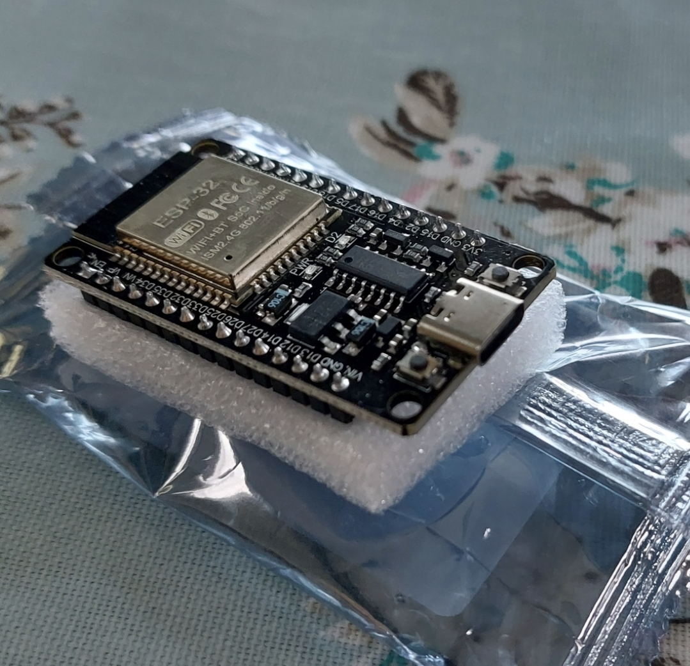
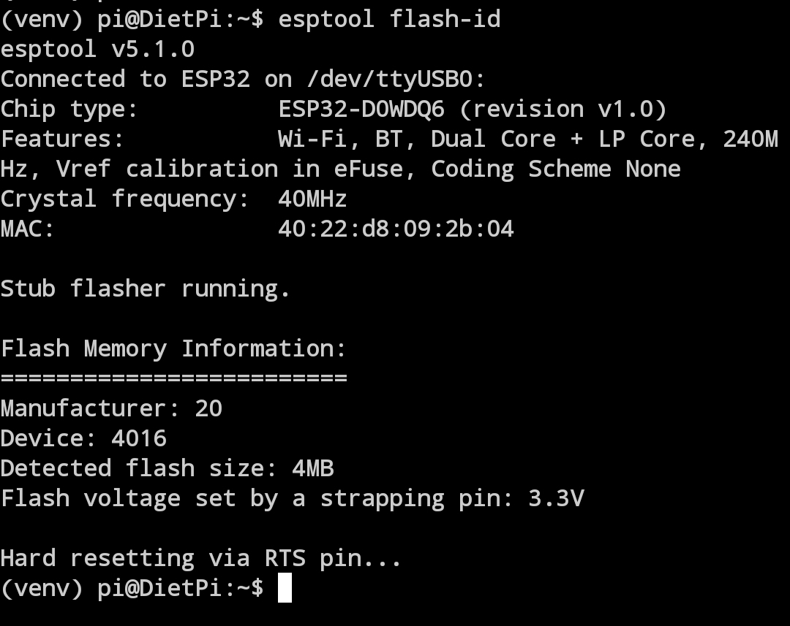
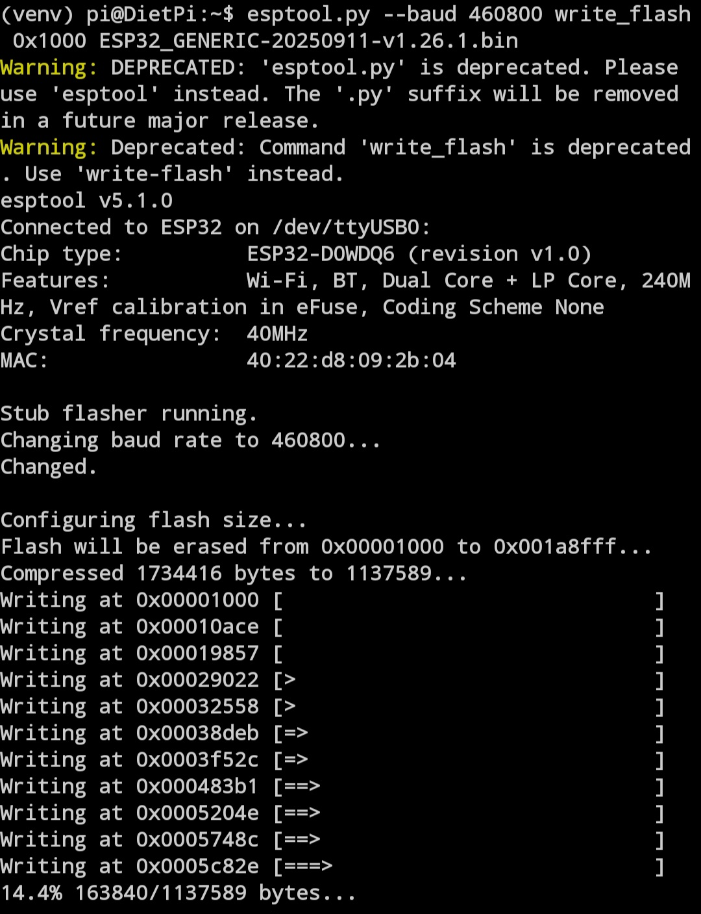
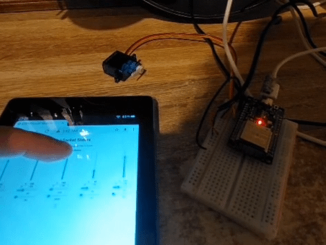
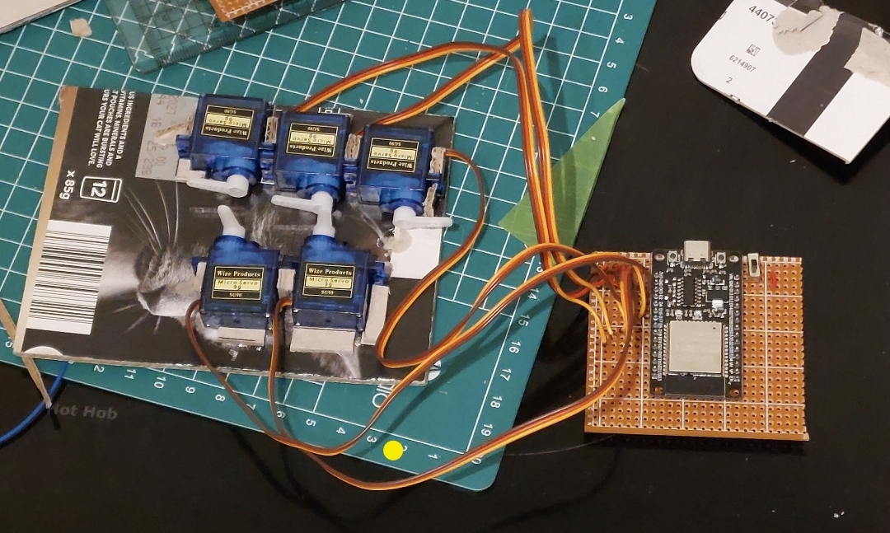
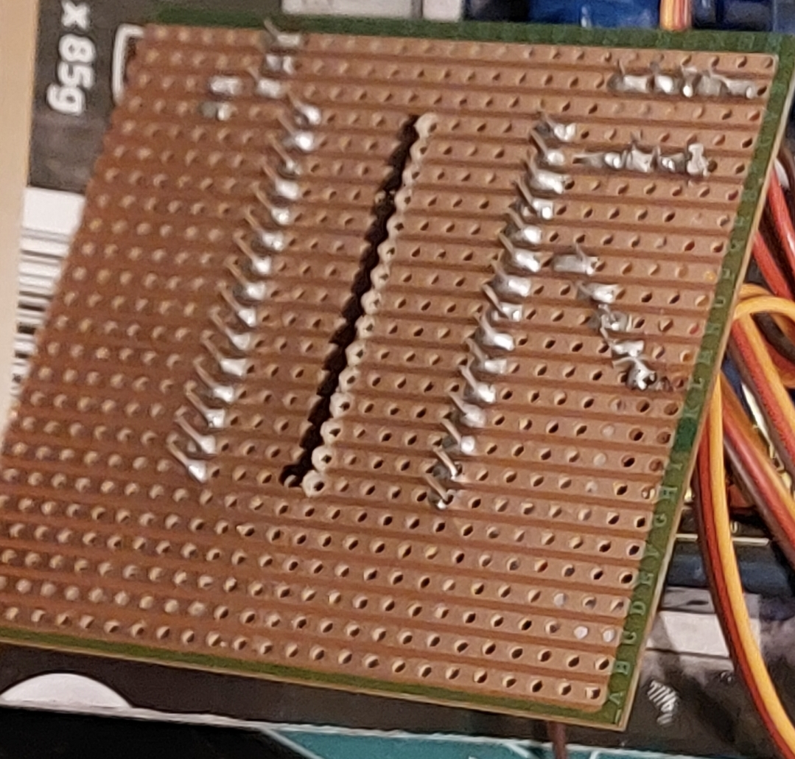

# cardboard-hand

wireless access point for an esp32/pico

serves a page with sliders for the 5 servos used for fingers


very rough sketch, figers were one piece each from 4 ply cereal box card (pva laminate)

each joint was scored


each joint used paper straw (superglue) and hair bands used for digit extesion. each joint has a tiny securing node at the top reverse to secure the band.

_17-9-25_


housing for servos. will likely need securing better. should get the other 2 on the other side. not sure yet where or how to mount the "wrist".

added some code from chatgpt and https://docs.micropython.org/en/latest/esp32/quickref.html

_26-9-25_



esp32s arrived, code complete or thereabouts. hotspot and page http://192.168.4.1/




esptool is used to flash rom and install the micropython binary

had to install mpremote. commands are:

```
mpremote fs cp *html *py :
mpremote connect /dev/ttyUSB0
```

repl appears `ctrl+d` to run `main.py`

reset button is quicker



next:


_1-10-25_





_4-10-25_

trying to get set up so ui will at least run 

podman run -it --rm -v %cd%:/work -p 8000:80 -w /work docker.io/micropython/unix bash -c "micropython main.py"

sort of works but need to check esp32 again
